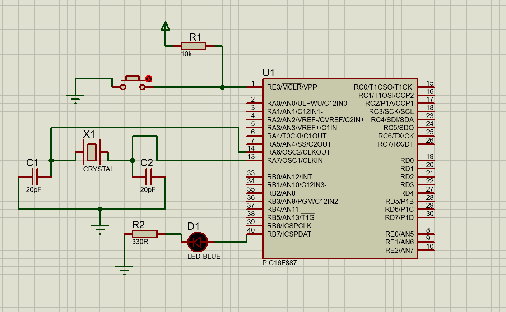

# Blinking_a_LED_circuit

## Description
This project demonstrates how to blink a single LED using a PIC16F887 microcontroller. The LED turns off for 1 second and on for 2 seconds, controlled via a program written in MikroC.

## Circuit
  
*The circuit schematic for 1 LED.*

## Files
- `LED.pdsprj`: Circuit schematic designed in Proteus.
- `tp2_1sOn_2sOff.c`: MikroC program for blinking the LED.

## Instructions
1. Open the `LED.pdsprj` file to view the circuit setup.
2. Load `tp2_1sOn_2sOff.c` into MikroC and compile it to generate the hex file.
3. Upload the hex file to the microcontroller in Proteus.
4. Run the simulation to observe the LED blinking.

## Tools
- MikroC Pro for PIC
- Proteus ISIS
